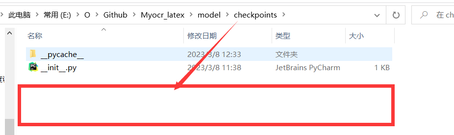
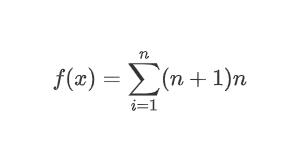

# Myocr_latex

用于识别公式转为LATEX编码

## 一、权重文件

**百度网盘：**链接：https://pan.baidu.com/s/1BMCPBacFaKoIvDeAXMxygA 提取码：cffv

> 将下载的文件解压，复制到model\checkpoints\目录中





## 二、环境配置

```
pip install -r requirements.txt -i https://pypi.tuna.tsinghua.edu.cn/simple
```

## 三、推理

```
python main.py
```

## 四、效果展示

**输入图片：**



**输出:**

```
$f(x)=\sum_{i=1}^{n}(n+1)n$
```

## 五、参考

- https://github.com/lukas-blecher/LaTeX-OCR
